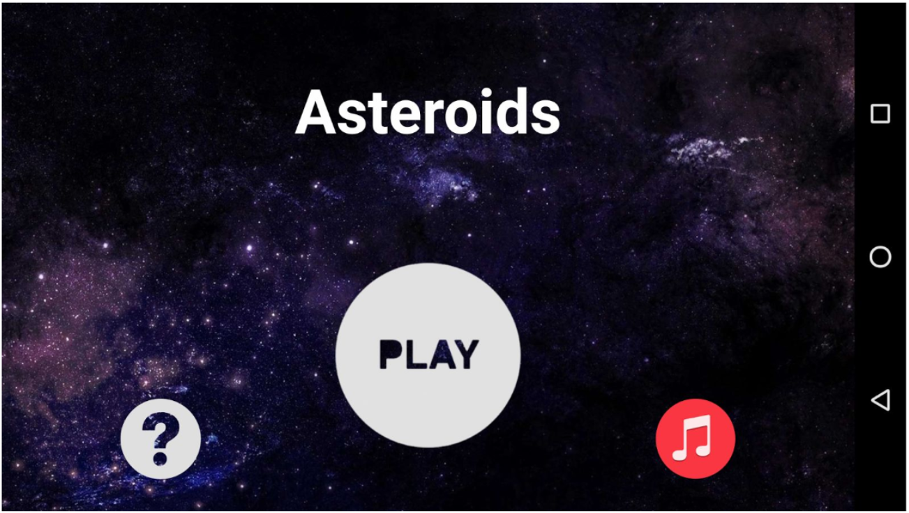
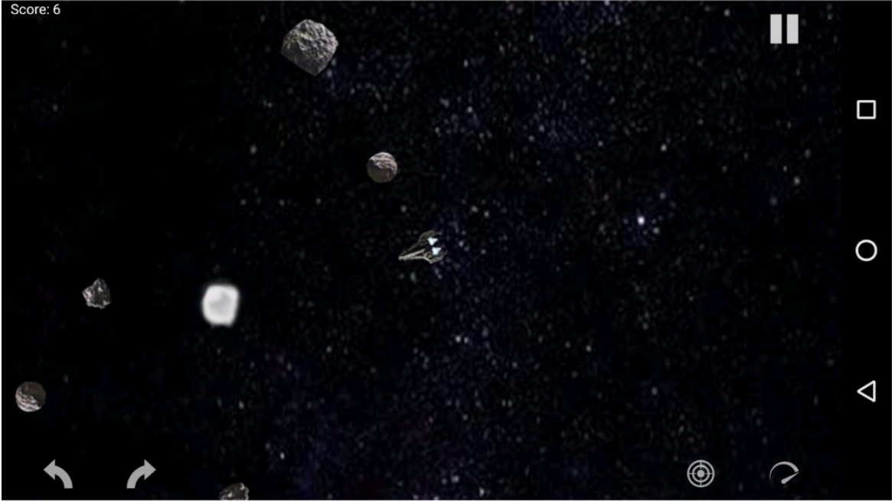

# LPOO - Object Oriented Programming Laboratory
Projects made in Object Oriented Programming Laboratory class - MIEIC 2y2s 

## Project 1 - Maze Game (PC)
This project is a PC maze game developed with Java. Unfortunately can't find the report of the project, but just compile the Java project and you are good to go!

## Project 2 - Asteroids Game (Android)
Recreation of the Asteroids Game for Android. For more information about the implementation and how it workds, see the report: 
For the APK of the game see the releases: 

